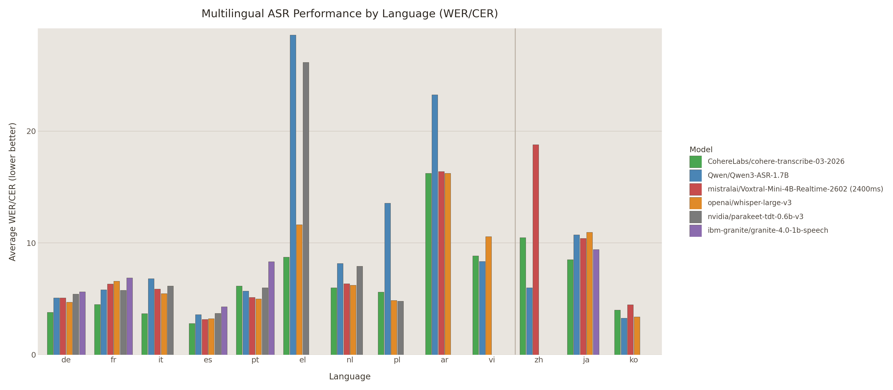

# CohereX

**Accurate Word-Level Timestamps and VAD Preprocessing for Cohere ASR**  
*By [Diffio.ai - Audio Restoration](https://diffio.ai)* | *Written by Codex*

CohereX provides fast, highly accurate speech recognition by combining Cohere's state-of-the-art ASR model with robust Voice Activity Detection (VAD) and forced phoneme alignment. Inspired by WhisperX, it is designed as a drop-in replacement that uses the same interface and outputs as WhisperX.

**Benchmarks:**

*(Tested on a 48 min 28 sec audio file with batch size 8 on an RTX 6000 Ada GPU)*

| System | VAD+ASR | Total | Speed |
|---|---:|---:|---:|
| WhisperX large-v3-turbo + pyannote | 8.81s | 15.27s | 330.25x realtime |
| coherex + Cohere + FireRedVAD | 11.17s | 16.49s | 260.36x realtime |
| WhisperX large-v3 + pyannote | 16.93s | 22.36s | 171.76x realtime |

---

## Features

- **Accurate Word-Level Timestamps:** Utilizes wav2vec2 alignment by default, with optional Qwen3 and NeMo forced alignment backends.
- **Advanced VAD Preprocessing:** Integrates highly accurate Voice Activity Detection to handle long audio files efficiently and reduce hallucinations. Features support for the exceptional [FireRedVAD](https://github.com/FireRedTeam/FireRedVAD).
- **Language Identification:** Robust language detection capabilities using dual language ID models.
- **Production Ready:** Easy-to-use CLI and Python API.

*(Note: CohereX does not currently support speaker diarization.)*

---

## About Cohere ASR

CohereX is built on top of the newly released, state-of-the-art ASR model from [Cohere Research](https://cohere.com/research). 

The base model, `cohere-transcribe-03-2026`, is open-sourced under the Apache-2.0 License and provides exceptional transcription quality across multiple domains.
- Hugging Face: [CohereLabs/cohere-transcribe-03-2026](https://huggingface.co/CohereLabs/cohere-transcribe-03-2026)
- Blog Post: [cohere-transcribe-03-2026-release](https://huggingface.co/blog/CohereLabs/cohere-transcribe-03-2026-release)



---

## Voice Activity Detection (VAD)

To efficiently process long audio files and prevent the ASR model from hallucinating on background noise or silence, CohereX employs VAD preprocessing. 

We proudly support **FireRedVAD**, an open-source, highly robust VAD model that significantly improves the segmentation of audio before it is passed to the transcription engine.

## Forced Alignment

Like WhisperX, CohereX achieves highly accurate word-level timestamps by performing forced alignment after the initial transcription. By default we use wav2vec2 models to align the generated text with the original audio, and we also support `Qwen/Qwen3-ForcedAligner-0.6B` and NVIDIA NeMo Forced Aligner as alternative backends. The Qwen backend is limited to Chinese, English, Cantonese, French, German, Italian, Japanese, Korean, Portuguese, Russian, and Spanish, so CohereX will raise an error if Qwen alignment is requested for another detected language. The NeMo backend works with NeMo CTC or hybrid CTC checkpoints; CohereX provides an English default model and requires `--align_model` for other languages.

## Language Identification

CohereX includes a robust language identification step before transcription. We utilize two specialized language ID models to accurately compute and determine the spoken language in the audio segment. This ensures the Cohere ASR model is conditioned correctly for optimal transcription accuracy.

---

## Installation

```bash
# Sync the CohereX project environment from the repo root
uv sync --extra dev

# Install the optional Qwen forced-alignment backend
uv sync --extra dev --extra qwen

# Install the optional NeMo forced-alignment backend
uv sync --extra dev --extra nemo
```

The project metadata lives in [`pyproject.toml`](/home/nharmon/git/CohereX/pyproject.toml), so you can run `uv` commands directly from the repository root.

---

## Usage (CLI)

You can run CohereX directly with `uv` from the repository root:

```bash
uv run coherex audio.mp3
```

**Common Options:**
- `--model`: Specify the Cohere model size/version (default: `cohere-transcribe-03-2026`).
- `--vad_method`: Choose the VAD model, e.g., `firered` (default) or `pyannote`.
- `--language`: Force a specific language code (e.g., `en`). If omitted, language ID will be computed automatically.
- `--align_backend`: Choose `wav2vec2` (default), `qwen3`, or `nemo` for forced alignment.
- `--align_model`: Specify a custom alignment model. For `qwen3`, the default is `Qwen/Qwen3-ForcedAligner-0.6B`. For `nemo`, pass a NeMo CTC or hybrid CTC checkpoint.

### Selecting A Forced-Alignment Backend

Use the default wav2vec2 backend:

```bash
uv run coherex audio.mp3
```

Select the Qwen3 backend:

```bash
uv run coherex audio.mp3 --align_backend qwen3
```

Select the NeMo backend:

```bash
uv run coherex audio.mp3 --align_backend nemo
```

Select the NeMo backend for English with an explicit language override:

```bash
uv run coherex audio.mp3 --language en --align_backend nemo
```

Select a custom wav2vec2 alignment model:

```bash
uv run coherex audio.mp3 \
  --align_backend wav2vec2 \
  --align_model jonatasgrosman/wav2vec2-large-xlsr-53-portuguese
```

Select a custom Qwen3 aligner checkpoint or local snapshot:

```bash
uv run coherex audio.mp3 \
  --align_backend qwen3 \
  --align_model Qwen/Qwen3-ForcedAligner-0.6B
```

Select a custom NeMo aligner checkpoint:

```bash
uv run coherex audio.mp3 \
  --align_backend nemo \
  --align_model stt_en_fastconformer_hybrid_large_pc
```

Select the NeMo backend for a non-English language by passing an explicit NeMo checkpoint:

```bash
uv run coherex audio.mp3 \
  --language de \
  --align_backend nemo \
  --align_model <your-nemo-ctc-or-hybrid-ctc-checkpoint>
```

Notes:
- `wav2vec2` remains the default, so you only need `--align_backend` when switching to `qwen3` or `nemo`.
- `qwen3` requires the optional dependency set: `uv sync --extra dev --extra qwen`
- `nemo` requires the optional dependency set: `uv sync --extra dev --extra nemo`
- `qwen3` only supports Chinese, English, Cantonese, French, German, Italian, Japanese, Korean, Portuguese, Russian, and Spanish.
- `nemo` currently defaults only for English in CohereX. For other languages, pass a NeMo CTC or hybrid CTC checkpoint with `--align_model`.
- `nemo` supports NeMo CTC checkpoints and hybrid RNNT-CTC checkpoints running in CTC mode. Pure RNNT checkpoints are not supported.

### NeMo Backend Quickstart

If you want to use NVIDIA NeMo Forced Aligner:

```bash
# 1. Install the optional backend
uv sync --extra dev --extra nemo

# 2. Run CohereX with the NeMo aligner
uv run coherex audio.mp3 --language en --align_backend nemo
```

If the detected or requested language is not English, also pass a compatible NeMo checkpoint:

```bash
uv run coherex audio.mp3 \
  --language es \
  --align_backend nemo \
  --align_model <spanish-nemo-ctc-or-hybrid-ctc-checkpoint>
```

In Python, the equivalent call is:

```python
model_a, metadata = coherex.load_align_model(
    language_code="en",
    device="cuda",
    backend="nemo",
)
```

---

## Python Usage

CohereX can be easily integrated into your Python applications with extensive configuration options:

```bash
uv run python
```

```python
import coherex

# 1. Load the Cohere ASR model with advanced options
model = coherex.load_model(
    model_name="cohere-transcribe-03-2026",
    device="cuda", # Use "cuda" for GPU or "cpu" for CPU
    device_index=0, # Select specific GPU index
    compute_type="default", # Options: "default", "float16", "bfloat16", "float32"
    language=None, # Set to a language code (e.g. "en") to skip auto-detection
    lid_method="speechbrain", # Language ID method: "speechbrain" or "taltech"
    vad_method="firered", # VAD method: "firered" (default), "pyannote", or "none"
    asr_options={
        "punctuation": True, # Enable/disable punctuation
        "suppress_numerals": False, # Suppress numerical digits in output
        "max_new_tokens": 448 # Maximum tokens to generate per chunk
    }
)

# 2. Load audio and run VAD + Transcription
audio_file = "audio.mp3"
audio = coherex.load_audio(audio_file)

# The transcribe method handles VAD chunking and batch transcription
result = model.transcribe(
    audio,
    batch_size=8, # Adjust based on your GPU VRAM
    chunk_size=30.0, # Adjust audio chunking duration (in seconds)
    print_progress=True # Show progress bar
)

print(f"Detected Language: {result['language']}")

# 3. Select an alignment backend and load the aligner.
# This requires the language code detected or specified in step 1.

# Default backend: wav2vec2
model_a, metadata = coherex.load_align_model(language_code=result["language"], device="cuda")

# Qwen3 backend
# model_a, metadata = coherex.load_align_model(
#     language_code=result["language"],
#     device="cuda",
#     backend="qwen3",
# )

# NeMo backend
# model_a, metadata = coherex.load_align_model(
#     language_code=result["language"],
#     device="cuda",
#     backend="nemo",
# )

# Custom backend + custom alignment model
# model_a, metadata = coherex.load_align_model(
#     language_code=result["language"],
#     device="cuda",
#     backend="wav2vec2",
#     model_name="jonatasgrosman/wav2vec2-large-xlsr-53-portuguese",
# )

# Align the transcribed segments to get accurate word-level timestamps
result = coherex.align(
    transcript=result["segments"], 
    model=model_a, 
    align_model_metadata=metadata, 
    audio=audio, 
    device="cuda", 
    return_char_alignments=False # Set to True to get character-level timestamps
)

# The result now contains accurate word-level timestamps
print(result["segments"]) 
```

## Regression Tests

After changing `coherex`, run the required regression suite:

```bash
PYTHONPATH=. COHEREX_TEST_DEVICE=cpu python -m pytest -q tests/test_regression_transcripts.py tests/test_regression_word_alignment.py
```

---

## Technical Details

CohereX processes audio in a multi-stage pipeline:
1. **VAD Segmentation:** The audio is chunked into active speech segments using FireRedVAD or Pyannote VAD.
2. **Language ID:** The language of the segments is computed using our dual-model language identification system.
3. **Transcription:** The active speech segments are batched and processed by the Cohere ASR model.
4. **Alignment:** The resulting text is aligned against the audio using either a wav2vec2 acoustic model, the optional Qwen3 forced aligner, or the optional NeMo forced aligner to generate precise word-level timestamps.

## Limitations

- **No Diarization:** CohereX does not currently support speaker diarization (identifying "who spoke when").
- **Compute Requirements:** Running the full pipeline (VAD + ASR + Alignment) requires a GPU with sufficient VRAM, especially for the larger Cohere models.
- **Alignment Language Support:** `wav2vec2` alignment depends on the availability of a compatible CTC model for the detected language. `qwen3` alignment currently supports Chinese, English, Cantonese, French, German, Italian, Japanese, Korean, Portuguese, Russian, and Spanish. `nemo` alignment works with NeMo CTC and hybrid CTC checkpoints; CohereX provides an English default and otherwise expects an explicit NeMo checkpoint.

---

## Acknowledgements

CohereX is made possible by several incredible open-source projects and research teams:

- **[Cohere](https://cohere.com/research):** For releasing the foundational `cohere-transcribe-03-2026` ASR model.
- **[FireRedTeam](https://github.com/FireRedTeam/FireRedVAD):** For the exceptional FireRedVAD model.
- **[Pyannote](https://github.com/pyannote/pyannote-audio):** For their foundational work in audio processing and VAD.
- **Forced Alignment Models:** Various open-source contributors for the wav2vec2 acoustic models used in our alignment step, and the [PyTorch Forced Alignment Tutorial](https://docs.pytorch.org/tutorials/intermediate/forced_alignment_with_torchaudio_tutorial.html) for the alignment methodology.
- **Language ID Models:** The creators of the dual language identification models used in our pipeline: [speechbrain/lang-id-voxlingua107-ecapa](https://huggingface.co/speechbrain/lang-id-voxlingua107-ecapa) and [TalTechNLP/voxlingua107-xls-r-300m-wav2vec](https://huggingface.co/TalTechNLP/voxlingua107-xls-r-300m-wav2vec).
- **[WhisperX](https://github.com/m-bain/whisperX):** For the inspiration and architectural blueprint for fast, aligned ASR pipelines.
